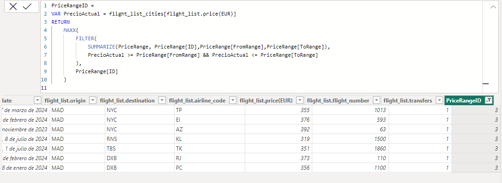

# Buscador de Vuelos desde Madrid
.jpg>)

Bienvenido al Buscador de Vuelos de Solo Ida desde Madrid. Este proyecto tiene como objetivo proporcionar a los usuarios una herramienta interactiva y efectiva para explorar y planificar sus vuelos de solo ida desde Madrid a diferentes destinos. A continuación, encontrarás una descripción detallada de este proyecto, incluyendo cómo funciona y cómo utilizarlo.

## Descripción del Proyecto

El Buscador de Vuelos permite a los usuarios buscar y explorar vuelos de solo ida con Madrid como origen. La aplicación ofrece varias funcionalidades clave para facilitar la planificación de viajes:

### 1. Visualización de Destinos en Mapa

La primera pantalla de la aplicación presenta un mapa interactivo que muestra las ubicaciones de los destinos de vuelo desde Madrid. Cada destino se representa mediante una burbuja en el mapa. 

- Al seleccionar un destino en el mapa, la aplicación muestra información detallada sobre los vuelos disponibles hacia esa ubicación, incluyendo el vuelo más barato.
Ejemplo: selección Bangkok

#### Detalles:
- Los destinos se obtienen con código Python de una fuente de datos externa utilizando una API pública. 
La URL de la API utilizada es [URL de la API](https://travelpayouts-travelpayouts-flight-data-v1.p.rapidapi.com/data/en-GB/airports.json).

- Una vez extraidos los datos, se estudian y se hace una limpieza básica, eliminamos valores duplicados...

- Pasamos a csv los data frame y llevamos los datos a Power Bi, cambiamos de nombre algunas columnas y combinamos dos tablas para hacer una relación mejor en Power Query.
- Relacionamos las tablas.

### 2. Búsqueda por Rango de Precio

La segunda pantalla de la aplicación permite a los usuarios ver los paises a los que podría volar en un rango de precios seleccionados, ajustándose a su presupuesto, utilizando un segmentador de datos.
Ejemplo, se ha seleccionado un rango de 0€ a 100€, dando como resultado los paises que vemos en el diagrama de barras.

### 3. Comparación de Aerolíneas

En la tercera pantalla de la aplicación, los usuarios pueden comparar las aerolíneas disponibles en función de sus precios. Se utiliza una gráfica área para representar visualmente las diferentes aerolíneas y sus precios, lo que facilita la identificación de las opciones más económicas y costosas.
Ejemplo, el rango de 0€ a 100€

#### Detalles:
- Para poder realizar el rango de precios se ha hecho un DAX:

- La gráfica de área muestra las aerolíneas en el eje X y los precios en el eje Y, lo que permite a los usuarios visualizar y comparar rápidamente las tarifas de diferentes aerolíneas.
- Al hacer clic en una aerolínea específica en la gráfica, los usuarios pueden ver el precio medio de los vuelos ofrecidos por esa aerolínea.

## Instrucciones de Uso

### Requisitos
- Para utilizar esta aplicación, los usuarios deben tener instalado Power BI Desktop o acceder a ella a través de Power BI Service.

### Instrucciones
1. Abre el archivo .pbix del proyecto en Power BI Desktop o accede a la aplicación en Power BI Service.
2. En la primera pantalla, selecciona un destino en el segmentador 'CITY' para explorar las opciones de vuelo disponibles y el vuelo más barato; seleccionamos el que nos interese y a la derecha de nuestra pantalla aparecerán todos los detalles de la selección: número de vuelo, compañía aérea...
3. En la segunda pantalla, utiliza el segmentador de datos para seleccionar un rango de precio y ver las opciones que existen: a qué paises se podría viajar con ese presupuesto.
4. En la tercera pantalla, explora la gráfica de área para comparar las aerolíneas disponibles y sus precios según el rango seleccionado.

## Contacto

Si tienes alguna pregunta, comentario o sugerencia sobre este proyecto, no dudes en contactarme en mmoralmh@gmail.com. Estoy disponible para ayudarte y responder a tus consultas.

